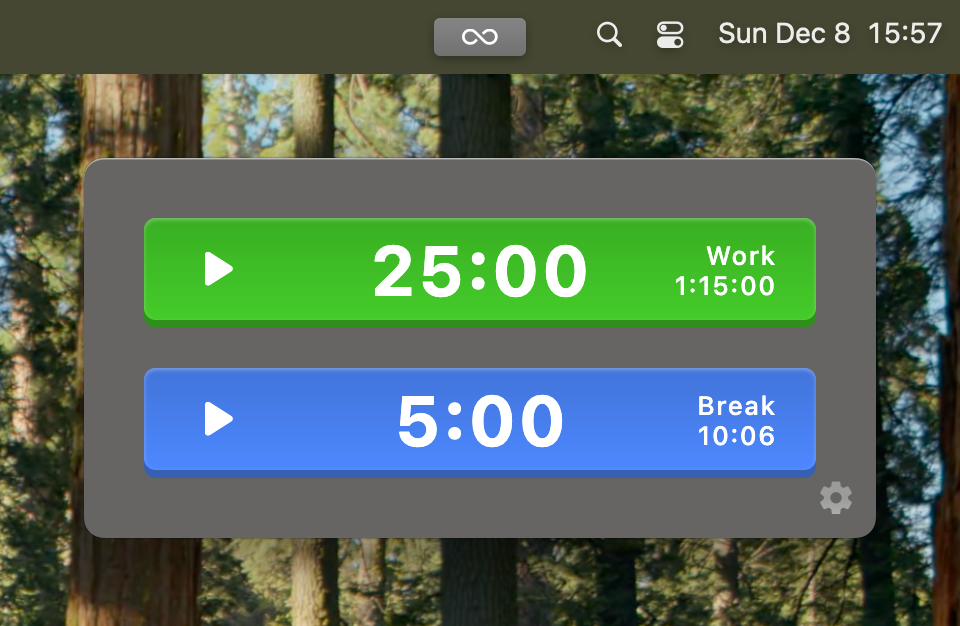
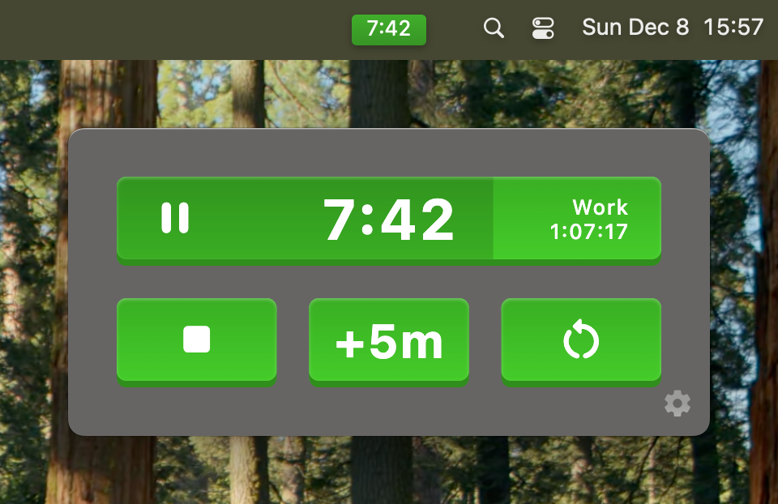
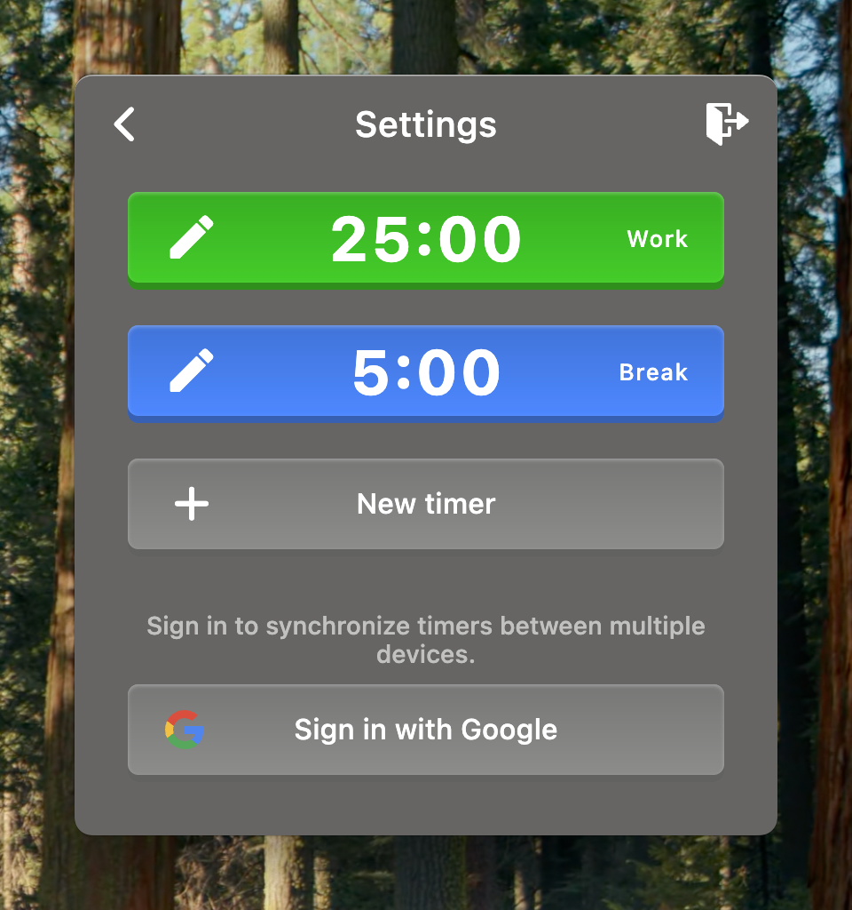
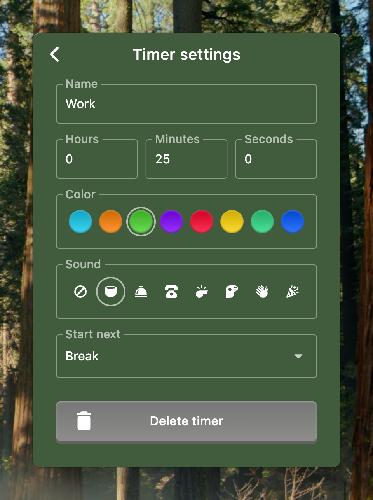

# Tomo

Tomo is a desktop timer app, primarily intended for the [Pomodoro technique](https://en.wikipedia.org/wiki/Pomodoro_Technique).









## Features

* Access app and see current timer progress via system menubar
* Pause, extend or restart timer
* See daily total time for each timer
* Configure multiple timers with dependencies
* Configure completion sound effects
* Sync timer config across devices via iCloud

## Implementation

Tomo is a native macOS app written in Swift using AppKit. Requires macOS 13+.

## Building

Requires [XcodeGen](https://github.com/yonaskolb/XcodeGen):

```sh
brew install xcodegen
```

Generate the Xcode project and build:

```sh
xcodegen generate
xcodebuild -project Tomo.xcodeproj -scheme Tomo build
```

Or open `Tomo.xcodeproj` in Xcode and hit Cmd+R.

### Code signing

By default the project has no signing configuration. To enable automatic signing, create a `local.yml` file (gitignored) in the project root:

```yaml
targets:
  Tomo:
    settings:
      base:
        CODE_SIGN_STYLE: Automatic
        CODE_SIGN_IDENTITY: "Apple Development"
        DEVELOPMENT_TEAM: YOUR_TEAM_ID
```

Then regenerate the project with `xcodegen generate`.
